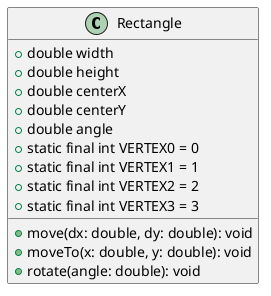

# 1 验证性内容学习情况自查

完成实验1的第2部分内容的学习。

1. 是否完成2.1部分内容，理解类的声明和定义的基本语法，能独立绘制简单类图？
是
2. 是否完成2.2部分内容，理解构造器和初始化器的基本用法，掌握对象的创建与成员访问的基本语法？
是
3. 是否完成2.3部分内容，理解类成员的基本概念以及用法？
是
4. 是否完成2.4部分内容，理解静态环境的概念及用法？
是
5. 是否完成2.5部分内容，熟悉访问控制符的用法？
是
6. 是否存在其他学习问题？  
这个（5）声明4个静态常量用于表示矩形顶点的编号（0,1,2,3），包括 VERTEX0 、 VERTEX1 、 VERTEX2 、 VERTEX3 ；
```java
    private static final int VERTEX0 = 0;
    private static final int VERTEX1 = 1;
    private static final int VERTEX2 = 2;
    private static final int VERTEX3 = 3;
```
有什么作用呢?  
或者为什么要这样写呢？

# 2 矩形类图


